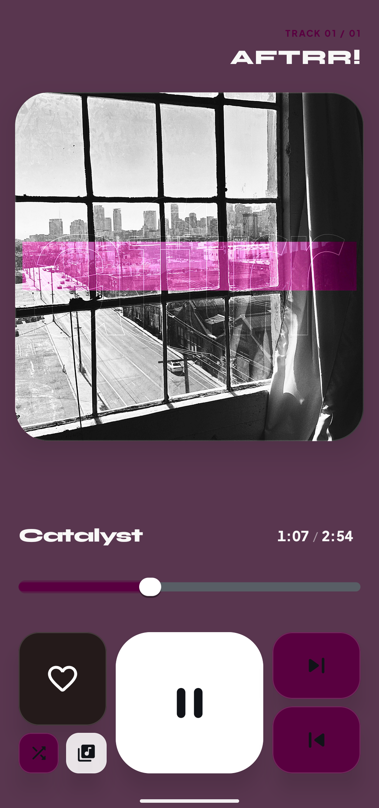
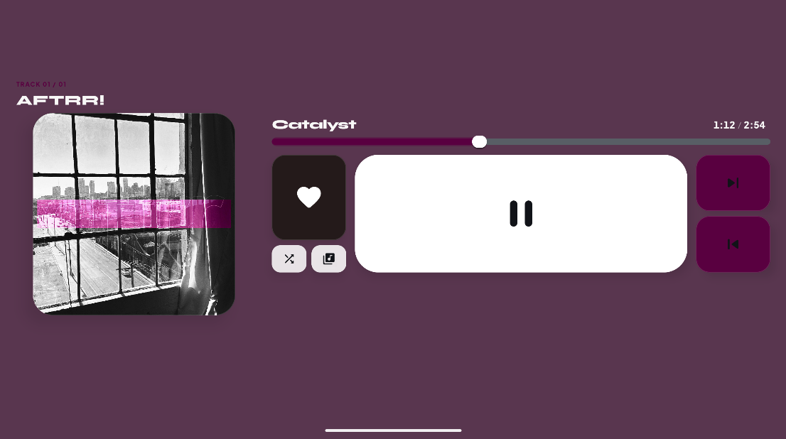

# Sonar Music Player

[](https://github.com/norealist/sonar/releases)
[](LICENSE)

Sonar is a native Android music player focused on local audio playback and a custom audio pipeline.

---

<p align="center">
  
  
</p>

---

> [!WARNING]
> Sonar currently has a cache-size issue. The application's cache may grow to approximately the size of the selected music directory. For example, if you select emulated/0/Music containing 5 GB of music, Sonar's cache may also grow to around 5 GB. 
> 
> This issue is being investigated and will be fixed in an upcoming update. 
> The issue does not affect the original music files.

## Roadmap

| Status | Priority | Feature | Description |
| :---: | :---: | :--- | :--- |
| ✅ | **Done** | Release v1.1 | |
| ⏳ | **High** | `MediaSessionService` | Background playback, notification media controls, lock screen widget, and Bluetooth headset button support. |
| ⏳ | **Medium** | **Interactive Like / Favorites** | Functional heart button with persistent local storage and dynamic "Favorites" playlist. |
| ⏳ | **Normal** | **Synchronized Lyrics** | Real-time synced lyrics parsing (`.lrc` & embedded tags) styled with dynamic typography highlighting. |

---

## Current Features

- Local library import from a selected directory.
- Metadata and embedded artwork extraction from audio files.
- List and grid library layouts with sorting and search.
- Queue order based on the currently displayed library order.
- Queue sheet that opens at the current track position.
- Previous and next playback controls.
- Shuffle order without repeating tracks until the queue cycle is complete.
- Repeat modes: `OFF`, `ALL`, and `ONE`.
- Artist Screen with local tracks, collaboration artist matching, Deezer artist statistics, and cached artist artwork.
- Artist Screen grid and list layouts with responsive portrait and expanded layouts.
- Dynamic artwork-derived colors and native Compose UI.
- High-resolution output preference with runtime device format negotiation.
- About screen with project source link.

## Architecture

```text
Android Compose UI
    -> PlayerViewModel
    -> AppPlayerController
    -> PlayerGateway
    -> Sonar Core Kotlin API
    -> JNI bridge
    -> C++ PlaybackEngine
    -> Decoder and AudioTrack output
```

The app layer owns library, metadata, queue, navigation, settings, Artist Screen, and Deezer artist data. Sonar Core owns decoding, PCM buffering, output negotiation, and native playback.

## Modules

### `sonar-app`

The Android application module. It contains:

- Compose screens and reusable UI components;
- library and metadata repositories;
- playback controller and gateway;
- queue, shuffle, repeat, and settings state;
- Deezer artist API/cache integration;
- runtime assets in `src/main/assets`;
- Android font resources in `src/main/res/font`.

### `sonar-core`

The Android library and native audio engine. It contains:

- Kotlin player API;
- JNI bridge;
- C++ playback engine;
- WAV, MP3, FLAC, Vorbis, and Opus decoder integrations;
- AudioTrack output and output-format negotiation;
- Kotlin, instrumented, and native smoke-test projects.

## Deezer Integration

The app uses the Deezer public API directly from Android. No browser CORS proxy is required.

For an artist profile it loads:

- `nb_album`;
- `nb_fan`;
- `picture_xl`;
- artist link and ID.

Artist statistics are cached for 15 minutes. Artist artwork is downloaded once per Deezer artist ID and stored in the app files directory:

```text
filesDir/deezer/artists/<deezer-id>.jpg
```

Deezer track playback and remote track importing are not implemented.

## Runtime Assets

Android runtime assets are stored inside `sonar-app` and are independent from the local visual prototype:

```text
sonar-app/src/main/assets/logo2.png
sonar-app/src/main/assets/deezer-logo.png
sonar-app/src/main/res/font/doto_black.ttf
```

The former repository-level `ui/` directory is ignored by Git and remains available locally as a design/reference workspace. It is not required for an Android build.

## Build

Build the debug APK:

```powershell
.\gradlew.bat :sonar-app:assembleDebug
```

Run Sonar Core unit tests:

```powershell
.\gradlew.bat :sonar-core:testDebugUnitTest
```

Run a clean application build:

```powershell
.\gradlew.bat clean :sonar-app:assembleDebug
```

The debug APK is generated at:

```text
sonar-app/build/outputs/apk/debug/sonar-app-debug.apk
```

## License

Sonar's original code and assets are licensed under the Apache License, Version 2.0.

Copyright 2026 norealist.

See [LICENSE](LICENSE) for the full license text. Third-party libraries and fonts
remain under their respective licenses; see `sonar-core/THIRD_PARTY_NOTICES.md`
and the font license files in `sonar-app/src/main/assets/licenses`. See [NOTICE](NOTICE)
for the Deezer trademark and branding notice.

## Current Limitations

- A dedicated `MediaPlaybackService` and MediaSession are not implemented yet.
- Background playback lifecycle and media notification controls are still pending.
- Deezer integration currently provides artist metadata and artwork only.
- Actual output format depends on source bit depth and device AudioTrack support.

## Branches

- `master` contains the current stable project state.
- `dev` is the development branch and is synchronized from `master` when a development baseline is created.
