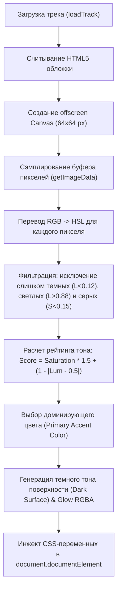

# Deep Dive: Player Screen UI, Typography, Visual Effects & Color Extraction Architecture

Этот документ представляет собой исчерпывающий технический и визуальный разбор контейнера плеера (`.player-container`) на экране **Player Screen** (`index.html`, `styles.css`, `app.js`).

---

## 📐 1. Общая архитектура и сеточные контейнеры (`.player-container`)

Контейнер `.player-container` является центральным блоком интерфейса плеера и адаптируется под устройство и ориентацию.

### Сетка и пропорции
- **Смартфон (`device-phone` / Портрет)**:
  - Вертикальный стек элементов: `player-left-panel` (обложка + артистический заголовок) $\to$ `player-right-panel` (название трека, таймер, скруббер и грид кнопок).
  - Внутренние отступы: `padding: 24px 20px 20px 20px`.
- **Планшет (`device-ipad-pro`, `device-ipad-mini`, `device-android-tablet` / Альбом)**:
  - 2-колоночный сплит-грид (`grid-template-columns: 380px 1fr; gap: 32px`).
  - **Левая панель**: Фиксированная ширина `380px`, содержит хэдер артиста и крупную обложку.
  - **Правая панель**: Занимает оставшееся пространство `1fr`, содержит заголовок, таймер, прогресс-бар повышенной точности и увеличенные кнопки управления.

---

## 🎨 2. Алгоритм и механика изменения цвета от обложки трека

Одной из главных фишек плеера является **динамическое извлечение цветовой палитры в реальном времени** из обложки воспроизводимого трека.

### Полный пошаговый процесс (в `app.js`):



### Код алгоритма с извлечением HSL и рейтинга тона:

```javascript
function extractColorsFromImage(imgEl) {
  const sampleCanvas = document.createElement('canvas');
  const sampleCtx = sampleCanvas.getContext('2d');
  sampleCanvas.width = 64;
  sampleCanvas.height = 64;

  sampleCtx.drawImage(imgEl, 0, 0, 64, 64);
  const imgData = sampleCtx.getImageData(0, 0, 64, 64).data;

  let colorBins = [];
  for (let i = 0; i < imgData.length; i += 16) {
    const r = imgData[i];
    const g = imgData[i + 1];
    const b = imgData[i + 2];
    const hsl = rgbToHsl(r, g, b);

    // Отсеивание невыразительных и крайних тонов
    if (hsl.l > 0.12 && hsl.l < 0.88 && hsl.s > 0.15) {
      colorBins.push({
        r, g, b, hsl,
        score: hsl.s * 1.5 + (1 - Math.abs(hsl.l - 0.5))
      });
    }
  }

  if (colorBins.length === 0) return;
  colorBins.sort((a, b) => b.score - a.score);

  const primary = colorBins[0];
  const primaryHex = rgbToHex(primary.r, primary.g, primary.b);
  const darkSurface = hslToHex(primary.hsl.h, Math.min(primary.hsl.s, 0.25), 0.28);
  const glowRGBA = `rgba(${primary.r}, ${primary.g}, ${primary.b}, 0.45)`;

  // Динамическая реактивная запись в CSS
  const root = document.documentElement;
  root.style.setProperty('--m3-expressive-green', primaryHex);
  root.style.setProperty('--m3-expressive-green-glow', glowRGBA);
  root.style.setProperty('--m3-surface-gray', darkSurface);
}
```

### Куда применяются извлеченные цвета:
1. **Заполнение ползунка прогресса (`#sliderFill`)**: окрашивается в `var(--m3-expressive-green)` с плавным переходом `transition: background-color 0.6s ease`.
2. **Эмбиентное свечение обложки (`.art-wrapper`)**: `box-shadow: 0 20px 50px rgba(0,0,0,0.6), 0 0 60px var(--m3-expressive-green-glow)`.
3. **Активные кнопки Shuffle 🔀 и Repeat 🔁 (`.active-green`)**: автоматически подхватывают актуальный акцентный тон текущей обложки.
4. **Контейнер поверхности (`--m3-surface-gray`)**: подстраивает мягкий тёмный гармонирующий подтон фона.

---

## 🔤 3. Шрифтовая система и типографика (`player-container`)

В контейнере плеера используются 3 строго распределенных шрифта:

| Элемент | Шрифт | Размер | Начертание | Особенности & CSS |
| :--- | :--- | :--- | :--- | :--- |
| **Имя артиста** (`#artistName`) | `Syne` | `1.4rem` (`1.15rem` при > 20 симв.) | `800` (ExtraBold) | `letter-spacing: 1px`, Uppercase, интерактивный переход на `artist.html` |
| **Тег индекса трека** (`#trackIndexTag`) | `Syne` | `0.72rem` | `800` | `TRACK 01 / 21`, `letter-spacing: 1.5px`, opacity 0.6 |
| **Название трека** (`#trackTitle`) | `Plus Jakarta Sans` | `1.3rem` | `800` | `line-height: 1.1`, `letter-spacing: -0.5px`, **`word-break: keep-all`** |
| **Таймер / Длительность** (`#timeDisplay`) | `Plus Jakarta Sans` | `0.95rem` | `800` | **`font-variant-numeric: tabular-nums`**, `"tnum"` (предотвращает прыжки цифр) |
| **Таймер сна (иконка)** | `Material Symbols` | `18px` | `400` | Появляется индикатор `bedtime` при активном таймере |

---

## ✨ 4. Визуальные эффекты, тени, свечения и Glassmorphic-элементы

### 1. Блок обложки (`.art-wrapper` & `.album-art`)
- **Размеры**: Квадратный 1:1 бокс.
- **Закругление**: `border-radius: 28px`.
- **Тени и свечения**:
  - `box-shadow: 0 20px 50px rgba(0, 0, 0, 0.6), 0 0 60px var(--m3-expressive-green-glow)`
  - Внутренняя тонкая граница: `border: 1px solid rgba(255, 255, 255, 0.15)`.
- **Анимация воспроизведения (`.art-wrapper.playing`)**:
  - При воспроизведении обложка плавно приподнимается и производит мягкое пульсирующее макро-дыхание:
  ```css
  .art-wrapper.playing {
    transform: scale(1.03);
    box-shadow: 0 24px 60px rgba(0, 0, 0, 0.7), 0 0 80px var(--m3-expressive-green-glow);
  }
  ```

### 2. Беэлаговый прогресс-скруббер (`.progress-section`)
- **Высота трека**: `12px`, закругление `100px`.
- **Фон трека**: `background: rgba(255, 255, 255, 0.12)`.
- **Ползунок заполнения (`#sliderFill`)**: `background: var(--m3-expressive-green)`.
- **Ползунок перетаскивания (`#sliderThumb`)**:
  - `22px × 22px` белый круг с тенью `0 4px 12px rgba(0, 0, 0, 0.4)`.
  - При скруббинге (`.seeking`) отключены CSS-транзишны для 0 мс задержки отклика на движения пальца/курсора.

---

## 🎛️ 5. Экспрессивная сетка кнопок управления (`.expressive-controls-grid`)

Сетка кнопок построена по асимметричной 3-колоночной схеме:

```
+-------------------+-----------------------+-------------------+
|  Heart Btn        |                       |   Prev Track      |
|  (96px × 96px)    |    PLAY / PAUSE       |   (120px × 96px)  |
+-------------------+    STADIUM PILL       +-------------------+
| Shuffle/Repeat    |    (96px × 210px)     |   Next Track      |
| Dual 250ms Pill   |                       |   (120px × 96px)  |
+-------------------+-----------------------+-------------------+
```

### 1. Кнопка Лайк (`#heartBtn`)
- **Размер**: `100% × 96px`, `border-radius: 28px`.
- **Фон**: `rgba(255, 255, 255, 0.85)` с тенью `0 12px 30px rgba(0, 0, 0, 0.35)`.
- **Активное состояние (`.active`)**: окрашивается в розовый акцентный стиль `active-pink` (`background: var(--m3-expressive-pink)`).

### 2. Двухрежимная кнопка 250 мс (`#repeatPillContainer`)
- **Конструкция**: Стадионный пилл-контейнер (`14px` border-radius).
- **Содержит**: `#shuffleBtn` и `#repeatBtn`.
- **Механика зажатия 250 мс**:
  - Короткий клик (< 250 мс): переключает текущий активный режим (вкл/выкл случайный порядок или цикл повтора).
  - Зажатие 250 мс: плавно сменяет вид активной кнопки прямо на месте с анимацией `scale(1.12)`.
- **Активный цвет**: Обе кнопки при активации подсвечиваются единым акцентным зелёным стилем (`.active-green`).

### 3. Центральная стадионная кнопка Play/Pause (`#playPauseBtn`)
- **Размер**: `96px × 210px`, закругление стадиона `100px`.
- **Состояние Паузы (`paused`)**:
  - Кнопка приподнята выше остальных: `transform: translateY(-5px)`.
  - Глубокая 3D-тень: `box-shadow: 0 20px 42px rgba(0, 0, 0, 0.55)`.
- **Состояние Воспроизведения (`playing`)**:
  - Кнопка нажата вровень с соседями: `transform: translateY(0)`.
  - Тень снижается до стандартного уровня: `box-shadow: 0 12px 30px rgba(0, 0, 0, 0.4)`.

### 4. Кнопки Следующий / Предыдущий трек (`#prevBtn`, `#nextBtn`)
- **Размер**: `120px × 96px`, `border-radius: 22px`.
- **Фон**: Светлый матовый glassmorphism `rgba(255, 255, 255, 0.85)`.
